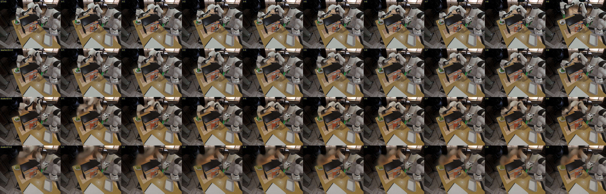
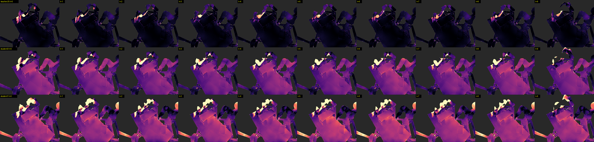

# Few-Step Distillation of Multi-View RGB-D World Models

Geo4D(Geometry-aware 4D Video Generation, ICLR 2026)는 로봇 조작 장면의 두 카메라 시점 RGB-D 미래 영상을 생성하는 확산 모델이다. 논문이 밝힌 한계대로 10프레임 생성에 20~30초가 걸려 closed-loop 계획에 쓰기 어렵다. 이 저장소는 그 추론 시간을 줄이면서 Geo4D의 장점인 뷰 간 기하 일관성과 비디오 품질이 남는지 측정한 기록이다.

결과를 한 줄로 적으면, 분포 매칭 증류(DMD)로 만든 3스텝 student에 입력 기반 깊이 보정과 bf16을 더해 순수 추론 시간을 21.8초에서 1.64초로 줄였고, 선명도·시드 다양성·왼쪽 뷰 깊이 정확도는 teacher와 같은 수준이었다. 오른쪽 뷰 깊이(AbsRel +0.022)와 LPIPS(+0.018)는 작지만 통계적으로 유의한 손실이 남는다.

- 기간 2026-08-20 ~ 08-23, 진행 중. RTX 5090 32GB 한 장(공유 서버).
- 날짜순 실험 기록: [docs/research_log.md](docs/research_log.md)
- 수치는 전부 직접 잰 것이다. 논문 인용은 arXiv 번호와 섹션을 적었다.

## 결과 요약

20샘플(뷰 40개), 데이터 시드 고정, paired Wilcoxon. 자세한 표는 아래와 `docs/research_log.md` 6절.

| | teacher 25스텝 | student 3스텝 + 앵커 + bf16 | 비고 |
|---|---|---|---|
| 순수 추론 시간 (10프레임×2뷰) | 21.80초 | 1.64초 (13.3배) | UNet compile 추가 시 약 1.5초(품질 20샘플 paired 확인), 디코더까지 compile 시 1.18초(5샘플만 확인) |
| 선명도 / 시드 다양성 | 0.0134 / 0.0227 | 0.0136 / 0.0224 | 차이 없음 (p=0.95 / 0.84) |
| 왼쪽 뷰 AbsRel / 뷰 간 정합 CV | 0.067 / 0.169 | 0.076 / 0.137 | 왼쪽 +0.008, CV는 개선 (p=0.006) |
| 오른쪽 뷰 AbsRel | 0.066 | 0.088 | +0.022, p<0.001 |
| PSNR / LPIPS | 20.62 / 0.118 | 20.43 / 0.136 | PSNR −0.19 (p=0.026), LPIPS +0.018 (p<0.001) |
| 1스텝 student | | 1.65초, AbsRel 0.116, LPIPS 0.177, 다양성 0.0117 | 다양성이 절반이라 품질 기준 미달 |

준정적 조작 목표(2초)는 충족했고 휴머노이드 목표(0.3~0.5초)는 고정비 0.63초 때문에 아직 아니다.

### 메인 표

| 방법 | 학습 | 스텝 | 순수 추론 | PSNR | AbsRel (왼/오) | LPIPS | 선명도 | 다양성 | CV |
|---|---|---|---|---|---|---|---|---|---|
| Geo4D teacher (Euler) | 없음 | 25 | 21.80초 | 20.62 | 0.066 (.067/.066) | 0.118 | 0.0134 | 0.0227 | 0.169 |
| teacher, 스텝만 축소 (Euler) | 없음 | 4 | 4.84초 | 21.22 | 0.064 | 0.132 | 0.0121 | 0.0131 | 0.165 |
| teacher, 스텝만 축소 (재노이징) | 없음 | 3 | 2.81초 | 21.30 | 0.066 | 0.132 | 0.0119 | 0.0120 | 0.167 |
| ODE 회귀 초기화 (v2) | 회귀 | 4 | 7.9초* | 14.42 | 0.547 | | 안개 | 시드 동일 | 0.137 |
| DMD student + 뷰별 앵커 (bf16) | DMD | 3 | 1.64초 | 20.43 | 0.082 (.076/.088) | 0.136 | 0.0136 | 0.0224 | 0.137 |
| DMD student + 뷰별 앵커 | DMD | 1 | 1.65초* | 20.56 | 0.116 | 0.177 | 0.0107 | 0.0117 | 0.165 |

\* v2는 평가 코드 포함 시간, 1스텝은 fp32 시간. 원본: `results/quantitative/precise_6a_main20.txt`, `precise_6a_main20_fast.txt`.

학습 없이 스텝만 줄인 teacher(3행)는 AbsRel이 그대로이고 PSNR은 오히려 높지만, 시드 다양성이 47% 줄고 선명도도 낮다. 적은 스텝에서 모델이 가능한 미래들의 평균을 내기 때문이고, 평균은 픽셀·깊이 오차에는 유리하다. DMD student는 다양성과 선명도를 되돌리는 대신 AbsRel과 LPIPS를 조금 잃는다. 어느 쪽이 나은지는 용도에 달렸고, 여러 미래를 샘플링해야 하는 월드모델에서는 다양성 쪽이 필요하다는 것이 이 작업의 전제다.

### 순수 추론 시간 분해

평가 코드를 뺀 경로(conditioner → 샘플러 → 생성물 디코딩). `results/quantitative/speed_variants.txt`.

| 경로 | UNet | conditioner | VAE 디코딩 | 총 |
|---|---|---|---|---|
| teacher Euler 25스텝 (CFG, 배치 40) | 20.13 | 0.73 | 0.89 | 21.75초 |
| student 재노이징 3스텝, fp32 | 1.19 | 0.73 | 0.88 | 2.81초 |
| + uc 생략 (student는 CFG를 쓰지 않음) | 1.18 | 0.30 | 0.90 | 2.38초 |
| + VAE 디코더 bf16 | 1.18 | 0.30 | 0.68 | 2.16초 |
| + UNet, conditioner bf16 | 0.66 | 0.30 | 0.68 | 1.64초 |
| + torch.compile (디코더, UNet) | 0.55 | 0.30 | 0.33 | 1.18초 |
| + 색 디코더 생략 (깊이만 쓰는 용도) | 0.55 | 0.30 | 0.16 | 1.02초 |

이전에 보고하던 25.4초/5.8초에는 평가 코드 오버헤드 2.9초가 섞여 있었다. 추론 UNet이 fp32로 돌고 있던 것이 가장 큰 낭비였다.

## 정성 결과

`results/qualitative/`. 각 폴더의 행 순서는 `results/qualitative/README.md`에 있다.



3스텝 student는 배경과 로봇이 모두 또렷하고, 1스텝은 움직이는 팔이 뿌옇다.



student의 오차가 화면 전체에 균일하게 깔려 있다. 구조가 틀린 게 아니라 깊이 스케일이 전역으로 밀린 것이고, 입력 앵커 보정으로 대부분 없어진다.

그 밖에

- `qualitative/`: 학습 없이 스텝만 줄였을 때 (1스텝에서 팔만 얼룩, 시드 4개 동일). `compare_left.gif`는 애니메이션.
- `student_qual/`: ODE 회귀 초기화의 전역 안개.
- `t3r_qual/`: 학습 없는 teacher 3스텝(재노이징). 시드 4개가 같은 그림.
- `videos/`: Self-Forcing, Causal-Forcing 재현 비디오.

## 과정

| 단계 | 한 일 | 결과 |
|---|---|---|
| 0 | Geo4D 추론 시간 분해 | UNet 25회가 93%. 메모리(13GB)는 병목이 아님 |
| 1 | 학습 없이 스텝 축소, 블러 가설 검증 | 8스텝까지 무손실. 1~2스텝에서 PSNR은 오르고 LPIPS·다양성·기하는 무너짐 |
| 2 | 평가 파이프라인 고정 | `bench_*.py`, 데이터 시드 고정 |
| 3 | Self-Forcing 재현 | 5090에서 8.2 FPS, 평균 붕괴 없음 |
| 4 | Causal-Forcing 3단계 체크포인트 비교 | 속도는 구조가, 품질은 학습이 결정 |
| 5 | DMD 학습 스모크 (Wan 1.3B) | 32GB 레시피: bf16 3벌, AdamW8bit, T5 셔틀, 메모리 프로브 |
| 6-1 | ODE 쌍 생성 | 284쌍 (데이터셋 142샘플 × 시드 2) |
| 6-2 | ODE 회귀 초기화 v1, v2 | 둘 다 안개. MSE 회귀는 평균으로 수렴 |
| 6-3 | Geo4D DMD | 2000스텝 1시간, 피크 24.4GB. 선명도·다양성 복원, 최적 ckpt step 1600 |
| 6-4(a) | 입력 앵커 보정 (조건 프레임 + 카메라 외부 파라미터) | student AbsRel 0.175→0.086. teacher도 0.072→0.060 |
| 6-4(c) | GT 감독 뷰 간 깊이 비 loss | 세 번 모두 DMD와 충돌해 PSNR −3.5dB |
| 7 | uc 생략, bf16, compile | 2.81→1.64→1.18초. bf16은 20샘플에서 무손실 |
| 8 | 정책 루프 평가 | 미수행 |

도중에 틀린 판단도 있었다. 오른쪽 뷰 GT의 53%가 데이터셋 변환 과정에서 생긴 가짜 픽셀이었는데, 이를 모르고 "teacher 오른쪽 뷰 붕괴", "student 구조 오류"라고 단정하고 학습 실험을 세 번 돌렸다. 마스크를 고친 뒤 철회했다. 세부는 `docs/research_log.md` 5절.

## 관찰한 것

1. 스텝을 줄이면 PSNR은 오르고 LPIPS·다양성·기하는 나빠진다. 픽셀 지표만으로는 붕괴를 못 본다.
2. 무너지는 순서는 다양성, LPIPS, 기하, PSNR 순이다.
3. 뷰 간 정합 지표(CV-Chamfer)는 두 뷰가 닮은 오답을 내면 좋아지고 스케일에 비례한다. 단독으로 쓰면 안 된다.
4. MSE 회귀 초기화는 진짜 궤적을 줘도 평균으로 수렴한다.
5. DMD는 400회 업데이트로 선명도와 다양성을 teacher 수준으로 되돌린다. 학습 중 표준편차 비율(생성/teacher)이 1.0에 가까운 체크포인트가 가장 좋다.
6. GT 감독 기하 loss는 DMD와 충돌한다(3회). 입력 정보만 쓰는 앵커는 충돌하지 않는다.
7. Geo4D의 두 뷰는 가중치를 100% 공유한다. `wrappers.py`의 뷰별 디코더 deepcopy가 얕은 복사 때문에 무효다.
8. 학습 없는 few-step teacher는 샘플러와 무관하게 다양성이 47% 준다. 비교 표에 꼭 들어가야 할 대조군이다.
9. 오른쪽 뷰 GT의 53%가 변환된 무효 픽셀이다. 제외 전 teacher 오른쪽 AbsRel 0.418, 제외 후 0.064.
10. 보고하던 시간에 평가 코드 2.9초가 섞여 있었다.
11. 입력 앵커 보정은 teacher 자체의 AbsRel도 개선한다.

## 저장소 구조

```
code/
  geo4d/                Geo4D(~/4dgen) 위에서 쓰는 스크립트. notebooks/ 에 두고 실행
    geo4d_fewstep.py      재노이징 few-step 샘플러 + 입력 앵커 보정
    geo4d_dmd_train.py    DMD 트레이너 (--cv_weight 0 = 바닐라)
    geo4d_ode_gen*.py     ODE 쌍 생성
    geo4d_ode_init_train*.py  ODE 회귀 초기화 (실패 기록)
    bench_*.py            평가·진단
    launchers/            서버에서 쓴 런처 (인자 조합 기록)
  geo4d_patches/        sm_120용 xformers→SDPA 패치, Self-Forcing 32GB 레시피 패치
  self_forcing/         self_forcing_dmd_5090.yaml, inference_timed.py
  setup/                환경·체크포인트 다운로드 스크립트
results/
  quantitative/         평가 결과 txt/json, logs/ 에 학습·평가 로그. 색인은 폴더 README
  qualitative/          정성 그리드, videos/
docs/research_log.md    날짜순 실험 기록
```

| 스크립트 | 용도 |
|---|---|
| `bench_eval_6x.py` | 표준 평가. 고정 시드, 설정 문자열(`T25 T4 S3 S3b S3c ...`), paired Wilcoxon, `--fix_mask`(가짜 픽셀 제외), 앵커 접미사 a/b/c |
| `bench_precise_6a.py` | LPIPS·선명도·다양성 포함 평가. `--fast`(bf16), `--compile`. 메인 표 |
| `bench_speed_variants.py`, `bench_profile_student.py` | 순수 추론 시간 분해, 가속 변형 |
| `bench_scale_diag.py`, `bench_cond_calib.py`, `bench_frame_diag.py` | 깊이 편향 진단 |
| `bench_student_qual.py`, `bench_qualitative.py` | 정성 그리드 |
| `check_extr.py`, `check_cond_transform.py` | 데이터셋 외부 파라미터·좌표계·가짜 픽셀 검사 |

## 재현

RTX 5090(sm_120) 기준: torch 2.11 + cu128, xformers 제거 후 SDPA 패치(`code/geo4d_patches/geo4d_4dgen.patch`), flash-attn은 빌드되지 않는다. Geo4D 코드·체크포인트(apple 태스크)·데이터는 원 저자 배포본을 쓴다 (`code/setup/` 참고). 스크립트는 `~/4dgen/notebooks/`에 두고 `~/4dgen`에서 실행한다. 경로(`/home/sun4208/...`)는 환경에 맞게 바꾼다.

```bash
# teacher 궤적 ODE 쌍 (284쌍, 약 2시간)
python notebooks/geo4d_ode_gen_v2.py --max_pairs 1000
# ODE 회귀 초기화 v2 (1200스텝, 약 1.5시간). DMD 초기 가중치
python notebooks/geo4d_ode_init_train_v2.py
# DMD (2000스텝, 약 1시간, 피크 24.4GB). step 1600 체크포인트 사용
python notebooks/geo4d_dmd_train.py --max_steps 2000 --out_dir ~/Geo4D/dmd_6a
# 메인 표 (20샘플, bf16, 약 20분)
python notebooks/bench_precise_6a.py --configs T25 T4 T3r S3b S1b --n_batches 20 --fast --tag _main20
# 추론 시간 분해와 가속 변형 (약 5분)
python notebooks/bench_speed_variants.py --n 5
```

## 한계

- 단일 태스크(apple), 고정 시드 20샘플, 단일 GPU. 다른 에피소드·태스크는 아직 안 봤다.
- 오른쪽 뷰 AbsRel +0.022, LPIPS +0.018. 1스텝은 품질 미달.
- 휴머노이드 목표는 고정비(conditioner 0.30 + 디코딩 0.33초)로 미달.
- 정책 루프 평가(Step 8)를 하지 않았다. Geo4D 한계 1번을 해결했다고 말하려면 필요하다.
- 사용한 방법(DMD, 재노이징 샘플러, bf16)은 기존 기법이다. 이 작업의 기여는 few-step이 멀티뷰 기하를 보존하는지의 첫 검증, 평가에서 드러난 함정들, 입력 앵커 보정, 그리고 실패 기록이다. teacher와 충돌하지 않는 기하 보존 학습이 하나 성공해야 방법 기여가 된다.

## 참고

Geo4D arXiv:2507.01099, DMD arXiv:2311.18828, DMD2 arXiv:2405.14867, CausVid arXiv:2412.07772, Self-Forcing arXiv:2506.08009, Causal Forcing arXiv:2602.02214, perception-distortion tradeoff arXiv:1711.06077, LPIPS arXiv:1801.03924.

코드 패치는 각 원 저장소(Geo4D/4dgen, Self-Forcing, Causal-Forcing)의 라이선스를 따른다.
